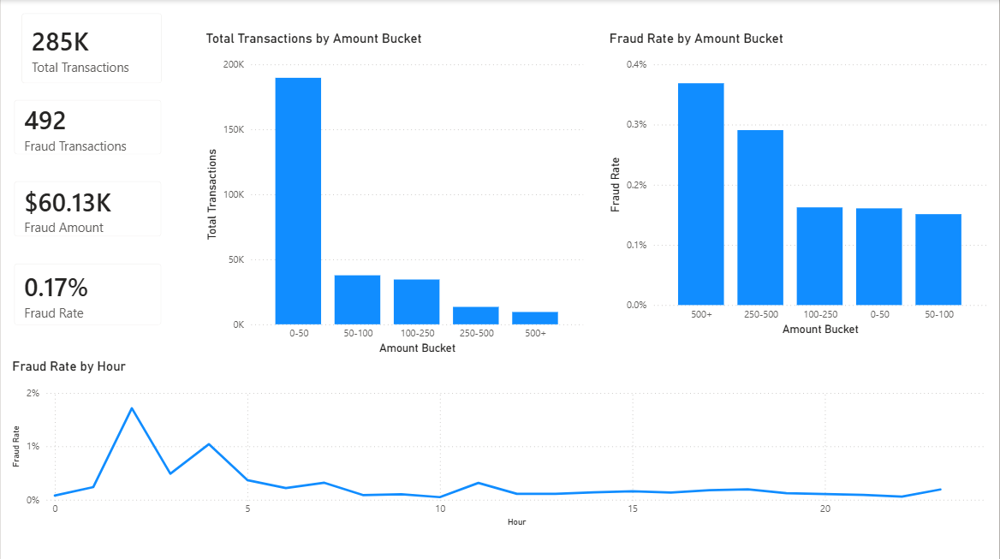

# Credit Card Fraud Analytics & Detection

An end-to-end data analytics and machine learning project for analyzing credit card transactions, identifying fraud patterns, segmenting transaction risk, and building predictive fraud detection models.

The project combines **Python, SQL, Power BI, and Machine Learning** to move from raw transaction data to actionable business insights and predictive modeling.

---

## 📊 Dashboard



The Power BI dashboard provides transaction-level fraud monitoring and risk segmentation across:

* Transaction volume
* Fraudulent transaction count
* Overall fraud rate
* Fraudulent transaction value
* Fraud rate by transaction amount
* Fraud rate by hour of the day
* Transaction volume by amount segment

---

## 🎯 Business Problem

Credit card fraud represents a very small proportion of total transaction activity, making it difficult to identify meaningful patterns through transaction volume alone.

The objective of this project is to answer key business questions such as:

* How prevalent is fraud across all transactions?
* How much transaction value is associated with fraudulent activity?
* Which transaction amount ranges have higher fraud risk?
* During which hours does fraud risk increase?
* Which transaction segments should receive greater monitoring?
* Can machine learning be used to automatically identify potentially fraudulent transactions?

---

## 🗂️ Dataset

The project uses the **Credit Card Fraud Detection** dataset containing **284,807 transactions**.

### Dataset characteristics

* **284,807 total transactions**
* **492 fraudulent transactions**
* **284,315 legitimate transactions**
* Fraud rate of approximately **0.17%**
* Highly imbalanced target variable
* Transaction amount and time information
* PCA-transformed numerical features (`V1`–`V28`)

The extreme class imbalance makes fraud detection a challenging classification problem and requires careful evaluation beyond simple accuracy.

---

## 🛠️ Tech Stack

| Category            | Tools               |
| ------------------- | ------------------- |
| Programming         | Python              |
| Data Analysis       | Pandas, NumPy       |
| Visualization       | Matplotlib, Seaborn |
| SQL Analysis        | SQL                 |
| Dashboard           | Power BI            |
| Machine Learning    | Scikit-learn        |
| Imbalanced Learning | SMOTE               |
| Model Tuning        | GridSearchCV        |
| Version Control     | Git, GitHub         |

---

# 🔎 Exploratory Data Analysis

The initial analysis focuses on understanding transaction behavior and identifying potential fraud patterns.

### Analysis performed

* Dataset structure and data quality analysis
* Fraud vs. legitimate transaction distribution
* Transaction amount distribution
* Transaction volume by amount range
* Fraud rate by transaction amount
* Fraud rate by hour
* Feature correlation analysis
* Outlier and distribution analysis
* Class imbalance analysis

### Key observations

#### 1. Fraud is highly imbalanced

Only **492 out of 284,807 transactions** are fraudulent, resulting in a fraud rate of approximately **0.17%**.

This means a model predicting every transaction as legitimate could still achieve very high accuracy while completely failing to detect fraud.

#### 2. Higher-value transactions show increased fraud risk

The analysis shows that fraud rates increase substantially for higher transaction amounts.

| Amount Range | Fraud Rate |
| ------------ | ---------: |
| 0–50         |    ~0.161% |
| 50–100       |    ~0.151% |
| 100–250      |    ~0.162% |
| 250–500      |    ~0.291% |
| 500+         |    ~0.369% |

Transactions above **$500** show the highest observed fraud rate among the analyzed amount segments.

#### 3. Fraud risk varies by transaction hour

Fraud is not uniformly distributed throughout the day.

The hourly analysis identifies noticeable spikes in fraud rate during specific hours, indicating that time-of-day can be useful for transaction risk analysis.

---

# 🧮 SQL Analysis

SQL was used to transform transaction-level data into business-oriented analytical metrics.

The SQL analysis includes:

* Overall transaction KPIs
* Fraud transaction counts
* Fraud rate calculations
* Transaction amount segmentation
* Fraud rate by amount bucket
* Fraud rate by hour
* High-risk hour and amount combinations
* Transaction volume analysis

Example analytical dimensions:

```text
Transaction Amount
Transaction Hour
Fraud Status
Amount Bucket
Fraud Rate
Transaction Volume
```

This layer bridges raw transaction data and the business insights presented in the Power BI dashboard.

---

# 📈 Power BI Dashboard

The Power BI dashboard was designed as a transaction-level fraud monitoring and risk segmentation interface.

### KPI Metrics

* **284.81K** Total Transactions
* **492** Fraud Transactions
* **0.17%** Fraud Rate
* **$60.13K** Fraudulent Transaction Amount

### Visualizations

#### Total Transactions by Amount Bucket

Shows where the majority of transaction activity occurs across different transaction-value segments.

#### Fraud Rate by Amount Bucket

Highlights transaction-value segments with relatively higher fraud risk.

The **$500+** segment has the highest observed fraud rate at approximately **0.369%**.

#### Fraud Rate by Hour

Shows how fraud risk changes throughout the day and highlights hours with unusually high fraud rates.

---

# 🤖 Machine Learning

After completing the descriptive analytics layer, machine learning models were developed to predict potentially fraudulent transactions.

### Workflow

```text
Data
 ↓
Data Cleaning & Preprocessing
 ↓
Train / Test Split
 ↓
Feature Scaling
 ↓
Class Imbalance Handling
 ↓
SMOTE
 ↓
Model Training
 ↓
Hyperparameter Tuning
 ↓
Model Evaluation
 ↓
Probability Threshold Optimization
```

### Models

* Logistic Regression
* Random Forest Classifier

### Imbalanced Data Handling

Because fraudulent transactions represent only a tiny fraction of the dataset, **SMOTE (Synthetic Minority Over-sampling Technique)** was used during model development to improve the model's ability to learn the minority fraud class.

### Hyperparameter Optimization

`GridSearchCV` was used to identify effective model configurations.

### Threshold Optimization

Instead of relying solely on the default classification threshold, probability threshold tuning was explored to control the trade-off between:

* Precision
* Recall
* False positives
* False negatives

This is particularly important in fraud detection, where missing a fraudulent transaction can be significantly more costly than investigating a legitimate transaction.

---

# 📊 Project Architecture

```text
                ┌──────────────────┐
                │  Transaction Data │
                └────────┬─────────┘
                         │
             ┌───────────▼───────────┐
             │   Python EDA &        │
             │   Data Exploration    │
             └───────────┬───────────┘
                         │
                  ┌──────▼──────┐
                  │ SQL Analysis│
                  └──────┬──────┘
                         │
              ┌──────────▼──────────┐
              │   Power BI          │
              │   Dashboard         │
              └──────────┬──────────┘
                         │
                ┌────────▼────────┐
                │ Business Insights│
                └────────┬────────┘
                         │
                 ┌───────▼────────┐
                 │ Machine Learning│
                 └───────┬────────┘
                         │
                 ┌───────▼────────┐
                 │ Fraud Prediction│
                 └────────────────┘
```

---

# 📁 Project Structure

```text
Credit-card-fraud-detection/
│
├── Notebooks/
│   └── EDA.ipynb
│
├── SQL/
│   └── fraud_analysis.sql
│
├── app/
│   └── ...
│
├── models/
│   └── ...
│
├── screenshots/
│   └── dashboard.png
│
├── src/
│   └── ...
│
├── .gitignore
├── requirements.txt
└── README.md
```

---

# 💡 Key Business Insights

### 1. Fraud is rare but financially significant

With only **0.17% of transactions being fraudulent**, transaction volume alone is not sufficient for effective fraud monitoring.

### 2. Transaction value is an important risk dimension

Higher-value transaction segments exhibit higher fraud rates, making transaction amount a useful dimension for risk segmentation.

### 3. Fraud risk changes throughout the day

The hourly analysis reveals specific periods with elevated fraud rates, suggesting that time-based monitoring rules could complement transaction-level fraud scoring.

### 4. Analytics and machine learning serve different purposes

The analytics layer explains **where and when fraud occurs**, while the machine learning layer focuses on **predicting which individual transactions may be fraudulent**.

---

# 🚀 Future Improvements

The current implementation provides an analytics and predictive MVP. Future production-level improvements could include:

* Automated ETL pipeline
* Cloud-based data warehouse
* Scheduled Power BI data refresh
* Real-time transaction scoring
* Fraud prediction API using FastAPI
* Model monitoring and drift detection
* Automated fraud alerts
* Risk scoring instead of binary classification
* Cost-sensitive model optimization
* Production deployment using AWS
* Interactive transaction-level investigation interface

---

# 📌 Skills Demonstrated

**Data Analytics**

* Exploratory Data Analysis
* KPI development
* Segmentation analysis
* Business insight generation
* Data visualization

**SQL**

* Aggregations
* Conditional analysis
* Grouping and segmentation
* Fraud-rate calculations
* Risk analysis

**Power BI**

* Dashboard development
* KPI cards
* Interactive visualizations
* Risk segmentation
* Business reporting

**Machine Learning**

* Classification
* Imbalanced learning
* SMOTE
* Random Forest
* Logistic Regression
* Hyperparameter tuning
* Precision/Recall analysis
* Threshold optimization

---

## 👤 Author

**Prakhar**

Machine Learning & Data Science Student

[GitHub](https://github.com/Prakhar1709)
